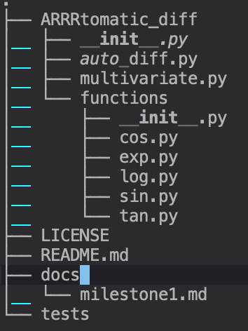

# Introduction

Our software package is an automatic differentiation suite that solves the problem of numerically computing the derivative for an arbitrary function as long as that function can be expressed as the composition of elementary functions. Precise computation of the gradient is of fundamental importance in the sciences and applied mathematics. Many optimization algorithms rely on gradient information. Indeed, the backpropagation algorithm, which is used to train neural networks, is simply gradient descent on the network's weights. Derivatives are also used in root finding methods such as Newton's methods, which are used to, among other things, numerically solve ordinary differential equations when using implicit methods. Reliable solutions to ODEs are important many of the applied sciences. Automatic differentiation offers an improvement over finite difference methods in that automatic differentiation is exact and does not suffer nearly as much from numerical stability issues. 

Reliable Jacobian computations underpin many numerical algorithms, and automatic differentiation offers a way to achieve that .

# Background

Automatic Differentiation of a function can be conceptualized as 

1. dividing that function into a composition of elementary operations through a computationl graph. An elementary operation includes
    1. Addition
    2. Multiplication
    3. Subtraction
    4. Division
    5. Exponentiation
    6. Logarithms
    7. Trigonometric functions
    
2. iteratively applying the chain rule at each step of the computational graph from beginning to end in order to propagate the exact numeric values of the partial derivatives all the way until the final step of the computational graph, which represents the output of the function. The partial derivatives at the final step are with respect to the function's variables and so represent the numeric value of the gradient for a chosen value of the function's variables.

The chain rule is 


TODO: explain how this generalizes to arbitrary multivariate, vector-valued functions

TODO: example here

# How to use ARRRtomatic_diff

We envision that a user will interact with our package by instantiating our core auto diff variable object and then composing complicated functions through the primitives exposed by our API. They would import the AutoDiffVariable object as well as the elementary functions we provide.

We provide an example below:

```python
from arrrtodiff import AutoDiffVariable
import arrrtodiff.functions as adfuncs

beta_0 = AutoDiff(name='b0', val=-3)
beta_1 = AutoDiff(name='b1', val=4)

for i in len(y):
    f += (y[i] - (beta_0 + beta_1 * x[i]))**2

f = f/len(y)

grad = f.get_gradient()

{
    'b0': ...,
    'b1': ...
}
```

# Software Organization

We expect the directory structure to look similar to the following



<!-- . -->
<!-- ├── ARRRtomatic_diff -->
<!-- │   ├── __init__.py -->
<!-- │   ├── auto_diff.py -->
<!-- │   ├── multivariate.py -->
<!-- │   └── functions -->
<!-- │       ├── __init__.py -->
<!-- │       ├── cos.py -->
<!-- │       ├── exp.py -->
<!-- │       ├── log.py -->
<!-- │       ├── sin.py -->
<!-- │       └── tan.py -->
<!-- ├── LICENSE -->
<!-- ├── README.md -->
<!-- ├── docs -->
<!-- │   └── milestone1.md -->
<!-- └── tests -->

We will distribute our package through PyPI. 

We will include the auto_diff module which defines the AutoDiffVariable object in our computational graph. This variable will overload elementary operations such as __add__ to not only maintain the current value in the computational graph / trace table but also all of the partial derivatives for all named variables. We will also have modules for each elementary function e.g. exp, log, sin, etc. These functions will use duck typing to attempt to update values and partial derivatives if passed an AutoDiffVariable object, otherwise they will assume the input is a numeric primitive.

We plan to maintain a test suite in another directory (specified in the hierarchy above) and will use both TravisCI and CodeCov. We will distribute our package via PyPI. We also plan to follow PEP 257 https://www.python.org/dev/peps/pep-0257/ for our documentation.

We will use setuptools (https://packaging.python.org/tutorials/packaging-projects/ ) to package out software. This seems to be standard approach within the Python community, and we believe that it is important to adhere to standards.

TODO: Other considerations?


# Implementation

We plan on implementing the forward mode of automatic differentiation through operator overlaoding. 

Our core data structure will be a representation of a particular row in the trace table / step in the computational graph. Users will instantiate named variables that represent root nodes in the computational graph or equivalently the first few rows of the trace table. They will then create more complicated functions by composing these variables with elementary operations. 

This will be implemented via the AutoDiffVariable class, which will handle all of the operator overloading. AutoDiffVariable objects can be combined through elementary operations to yield a new AutoDiffVariable object that hasg the appropriate value and partial derivatives. 

The AutoDiffVariable class will expose a few methods, namely get_named_variables, get_value, and get_gradient. The user will access get_gradient when they have finished writing their computational graph. As for attributes, the AutoDiffVariable class will simply maintain the names of its variables as well as a dictionary which contains the value of the function and its partial derivatives.

We will use numpy for elementary computations. 

We will create additional modules for each elementary function. Each module will contain a function that will update a AutoDiffVariable object accordingly. For example, "adfuncs.exp(x)" would exponentiate the value and then multiplty each partial derivative by the new exponentiated value.

We expect this approach to be robust enough to handle vector valued functions with vector inputs. We envision creating convenience methods if a user wishes to work in a multivariate setting i.e. we'll create convenience classes to create vectors of AutoDiffVariables and allow for broadcasting operations on iterables of AutoDiffVariable objects.


